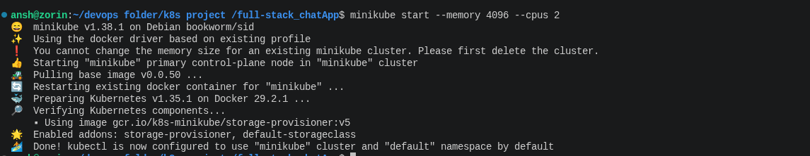
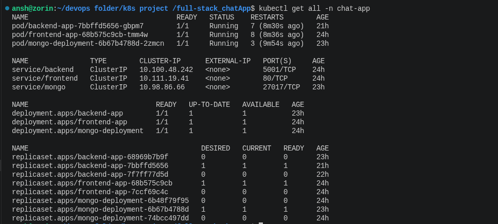
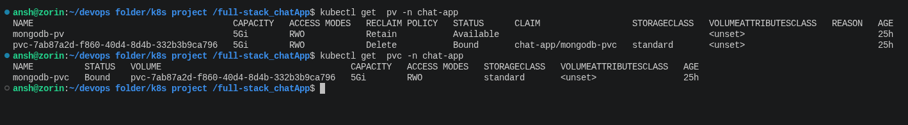
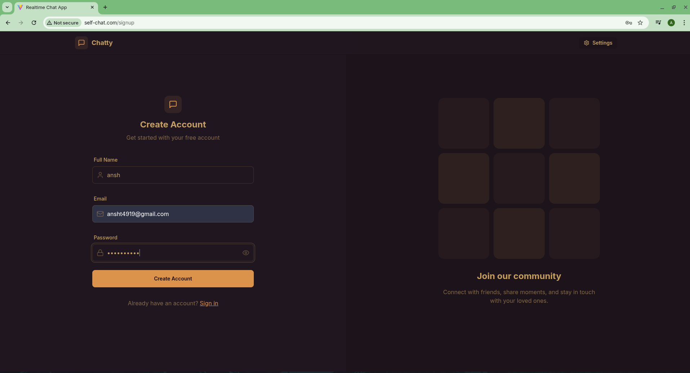
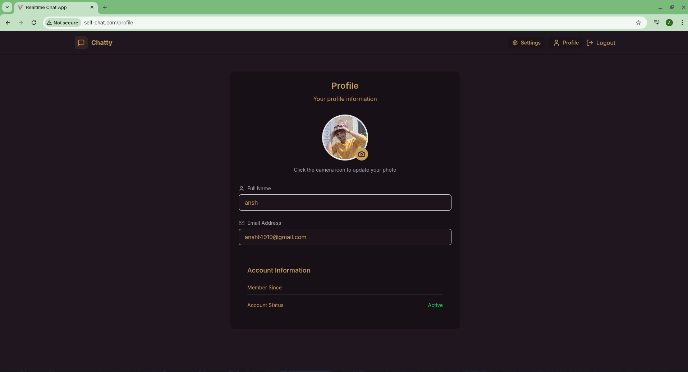

🚀 Multi-Tier Real-Time Chat Application on Kubernetes
This is a full-stack real-time chat application built using the MERN stack, containerized with Docker, and orchestrated using Kubernetes (Minikube). The project demonstrates advanced K8s concepts like Ingress, Persistent Storage, and Secrets management.

🏗️ Architecture Overiview
The application is split into three main tiers:

1.Frontend: React.js (Nginx for serving static files)

2.Backend: Node.js & Express

3.Database: MongoDB with Persistent Storage

🛠️ Kubernetes Components Implemented
I have architected the cluster with the following K8s objects to ensure scalability and data persistence:

Deployments: Managed scaling and rollouts for Frontend, Backend, and MongoDB pods.

Services: * ClusterIP for internal communication (Backend to DB).

NodePort/LoadBalancer for external access via Ingress.

Ingress: Configured Nginx Ingress Controller to route traffic through a custom domain (self-chat.com).

Storage (PV & PVC): Implemented Persistent Volumes to ensure MongoDB data survives pod restarts.

Secrets: Managed sensitive environment variables like MONGO_URI and JWT_SECRET securely.

🚀 Getting Started
Prerequisites
Docker & Minikube installed.
kubectl CLI configured.

Deployment Steps
1.Start Minikube:
  [minikube start --memory 4096 --cpus 2 ] 
  
2.Apply K8s Manifests:
  [kubectl apply -f k8s/]
  
3.Enable Ingress & Tunnel:
  [minikube addons enable ingress
  minikube tunnel]

4.Update /etc/hosts:
Add $(minikube ip) self-chat.com to your local hosts file.  

📸 Project Screenshots
1.Starting the minikube 

2.Displaying all pods, services, and deployments running in the `chat-app` namespace.

3.Persistent Storage (MongoDB)
Verification of Persistent Volumes (PV) and Claims (PVC) for database reliability.

4.Live Application UI
The React frontend in action, accessible via the custom domain.

5.Profile after creating a new account 

👨‍💻 Author
[ANSH TIWARI]

BCA Student | DevOps Enthusiast

Focusing on Linux, K8s, and AI-driven Infrastructure.

